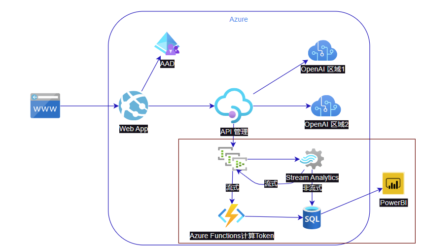

# 流式Azure OpenAI gpt token计数

### 1. 介绍
这是结合azure API Management和Azure Function实现的一个流式计数器，可直接部署在Azure Functions App上，用于计算Azure OpenAI GPT-3/4流式的token使用情况。并存放在Azure SQL DB中。
这项目的架构如下,主要涉及红框中的组件：

Azure Functions 将流式的response转换成如下格式, 仅供参考，不作计费使用:
```json
 { 
        "messages": "",
        "model": "",
        "usage":{
            "completion_tokens": 0,
            "prompt_tokens": 0,
            "total_tokens": 0
        }
    }
```
### 2. 前提

#### 2.1 Azure Eventhub
在一个eventhub服务(命名空间)里建两个eventhub实体， k1和kstream

#### 2.2 Azure APIM
这需要在APIM的policy中添加如下代码，用于将AOAI的response转换成上述格式。并且需要在APIM中添加一个outbound policy，用于将上述格式的response发送到Azure Function中。 <br/>
在APIM里创建evtLogger1 logger，用于将日志发送到Azure Eventhub中。 <br/>
``` powershell
#login to azure
Connect-AzAccount -TenantId  16b3c013-d300-468d-ac64-7eda0820b6d3

# API Management service-specific details
$apimServiceName = "apimxxx"
$resourceGroupName = "rgxxx"

# Create logger
$context = New-AzApiManagementContext -ResourceGroupName $resourceGroupName -ServiceName $apimServiceName
# Name is the hub instance name
New-AzApiManagementLogger -Context $context -LoggerId "evtLogger1" -Name "k1" -ConnectionString "xxx" -Description "Event hub logger with connection string"


```
在APIM里创建一个outbound policy <br/>
```xml
<policies>
	<inbound>
		<base />
		<set-variable name="request" value="@(context.Request.Body.As<JObject>(preserveContent: true))" />
	</inbound>
	<backend>
		<base />
	</backend>
	<outbound>
		<base />
		<set-variable name="response" value="@(context.Response.Body.As<string>(preserveContent: true))" />
		<set-variable name="x-region" value="@(context.Response.Headers.GetValueOrDefault("x-ms-region", ""))" />
		<log-to-eventhub logger-id="evtLogger1">
    @{
        return new JObject(
            new JProperty("EventTime", DateTime.UtcNow.ToString()),
            new JProperty("ServiceName", context.Deployment.ServiceName),
            new JProperty("RequestId", context.RequestId),
            new JProperty("RequestIp", context.Request.IpAddress),
            new JProperty("OperationName", context.Operation.Name),
            new JProperty("RequestBody", context.Variables["request"]),
            new JProperty("ResponseBody", context.Variables["response"]),
            new JProperty("Region", context.Variables["x-region"]),
            new JProperty("backendUrl", context.Request.Url.ToString())
        ).ToString();
    }
</log-to-eventhub>
	</outbound>
	<on-error>
		<base />
	</on-error>
</policies>

```
具体的apim配置参考： https://github.com/radezheng/tsgptAAD#%E9%85%8D%E7%BD%AEazure%E8%B5%84%E6%BA%90


#### 2.3 Azure SQL
建库建表，建表语句如下：
```sql
DROP TABLE IF EXISTS tblGPTLogs;
CREATE table tblGPTLogs (
    logId INT IDENTITY(1,1) PRIMARY KEY,
    EventTime DATETIME NOT NULL,
    ServiceName NVARCHAR(255) NOT NULL,
    RequestId UNIQUEIDENTIFIER NOT NULL,
    RequestIp NVARCHAR(50) NOT NULL,
    OperationName NVARCHAR(255) NOT NULL,
    RequestBody NVARCHAR(MAX) NOT NULL,
    ResponseBody NVARCHAR(MAX) NOT NULL,
    Region NVARCHAR(50) NOT NULL,
    BackendUrl NVARCHAR(255) NOT NULL,
    Streaming NVARCHAR(1) DEFAULT '0' NOT NULL,
)

```
#### 2.4 Azure Stream Analytics
实时读取eventhub k1 (input - ehgpt), 并将非流式的response写入Azure SQL DB (output - sqllog)中， 流式的response写入eventhub kstream(output - streamlog)中。 <br/>
query如下:
``` sql
SELECT
    DATEADD(hour, 8, CAST(ehgpt.EventTime AS DATETIME)) AS EventTime,
    ehgpt.ServiceName AS ServiceName,
    ehgpt.RequestId AS RequestId,
    ehgpt.RequestIp AS RequestIp,
    ehgpt.OperationName AS OperationName,
    ehgpt.RequestBody AS RequestBody,
    ehgpt.ResponseBody AS ResponseBody,
    ehgpt.Region as Region,
    ehgpt.BackendUrl as BackendUrl,
    '0' as Streaming
INTO
    [sqllog]
FROM
    [ehgpt] TIMESTAMP BY CAST(ehgpt.EventTime AS DATETIME)
WHERE
    LEFT(ehgpt.ResponseBody, 1) = '{'


SELECT
    CAST(ehgpt.EventTime AS DATETIME) AS EventTime,
    ehgpt.ServiceName AS ServiceName,
    ehgpt.RequestId AS RequestId,
    ehgpt.RequestIp AS RequestIp,
    ehgpt.OperationName AS OperationName,
    ehgpt.RequestBody AS RequestBody,
    ehgpt.ResponseBody AS ResponseBody,
    ehgpt.Region as Region,
    ehgpt.BackendUrl as BackendUrl,
    '1' as Streaming
INTO
    [streamlog]
FROM
    [ehgpt] TIMESTAMP BY CAST(ehgpt.EventTime AS DATETIME)
WHERE
    LEFT(ehgpt.ResponseBody, 4) = 'data'
```


### 数据展示
可以用PowerBI直接连Azure SQL DB